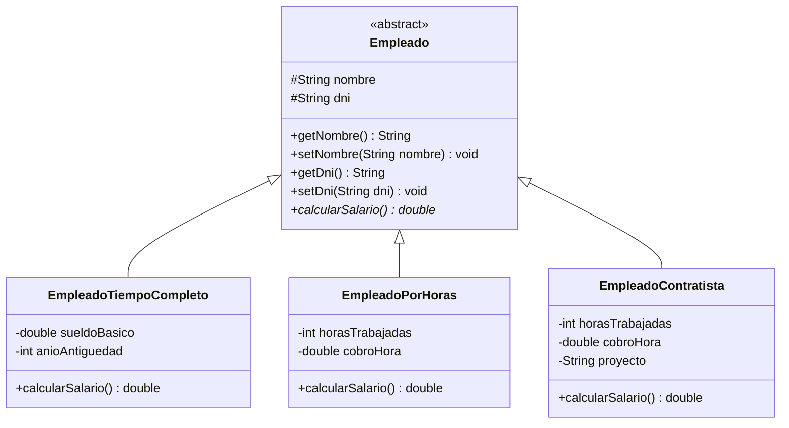

# Sistema de Gestión de Empleados en Java

Aplicación de consola desarrollada en Java para gestionar distintos tipos de empleados y calcular sus salarios según la modalidad de contratación.

El proyecto fue creado para practicar los fundamentos de Programación Orientada a Objetos, especialmente **herencia, abstracción, encapsulamiento, sobrescritura de métodos y polimorfismo**.

## Funcionalidades

- Cargar empleados a tiempo completo.
- Cargar empleados por horas.
- Cargar empleados contratistas.
- Evitar la carga de DNI duplicados.
- Validar textos vacíos.
- Validar valores numéricos negativos.
- Mostrar todos los empleados cargados.
- Buscar empleados por DNI.
- Calcular el salario de un empleado específico.
- Mostrar el salario de todos los empleados.
- Encontrar el empleado con el salario más alto.
- Controlar el límite máximo del arreglo de empleados.

## Tipos de empleados

### Empleado a tiempo completo

El salario se calcula a partir de un sueldo básico y un adicional según los años de antigüedad.

### Empleado por horas

El salario se calcula mediante:

```text
horas trabajadas × valor por hora
```

### Empleado contratista

El salario se calcula mediante:

```text
horas trabajadas × tarifa por hora
```

Además, cada contratista está asociado a un proyecto.

## Conceptos de Java aplicados

- Programación Orientada a Objetos
- Clases abstractas
- Herencia
- Encapsulamiento
- Polimorfismo
- Sobrescritura de métodos
- Constructores
- Arrays de objetos
- Métodos estáticos
- Validación de datos
- Uso de `Scanner`
- Menús con `switch`
- Bucles `while`, `do-while` y `for`

## Estructura sugerida

```text
sistema-empleados-java/
├── src/
│   └── sistemaempleados/
│       ├── Main.java
│       ├── Empleado.java
│       ├── EmpleadoTiempoCompleto.java
│       ├── EmpleadoPorHoras.java
│       └── EmpleadoContratista.java
├── README.md
└── .gitignore
```

## UML



## Menú principal

```text
========= SISTEMA DE EMPLEADOS =========

1. Cargar empleado tiempo completo
2. Cargar empleado por horas
3. Cargar empleado contratista
4. Mostrar todos los empleados
5. Calcular salario de un empleado
6. Mostrar salarios de todos
7. Buscar empleado
8. Mostrar empleado con mayor salario

0. Salir
```

## Cómo ejecutar el proyecto

1. Clonar el repositorio.
2. Abrir el proyecto en IntelliJ IDEA o cualquier IDE compatible con Java.
3. Ejecutar `Main.java`.
4. Utilizar el menú de consola para cargar y consultar empleados.

También puede compilarse y ejecutarse desde una terminal si se tiene instalado el JDK correspondiente.

## Posibles mejoras futuras

El proyecto está pensado para evolucionar a medida que se incorporen nuevos conocimientos de Java. Algunas mejoras posibles son:

- Reemplazar el array fijo por colecciones como `ArrayList`.
- Incorporar manejo de excepciones para entradas inválidas.
- Guardar empleados de forma persistente.
- Agregar lectura y escritura de archivos.
- Incorporar una base de datos.
- Agregar pruebas unitarias.
- Crear una interfaz gráfica o una API.

## Objetivo del proyecto

El objetivo principal es demostrar una implementación sencilla y clara de los fundamentos de POO en Java mediante un problema práctico de gestión de empleados.
